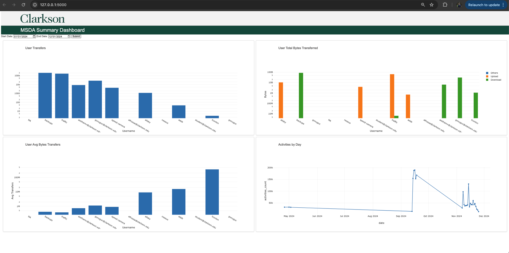
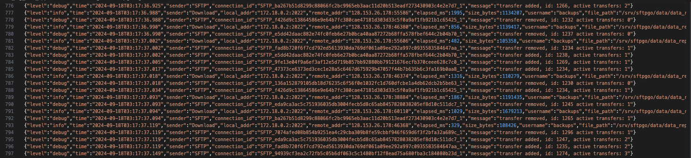

# msda_log_data_application

This application tracks MSDA Clarkson server live. It also stores historical activities , how many users accessed this server,how many bytes were transfered,  how many transfers, uploads , downloads by each user and also captures activities trend.

This implementation outlines a system for tracking and processing logs in real-time, handling both individual log file updates and the addition of new log folders. Below is a breakdown of the code, challenges, and solutions.



## log data description

We have a folder where it a has bunch of log files and also the live log file which captures activites on site live.
Once this live log file reaches the size of 10.5 MB , it renames the file to that date and stores in the same folder. Once again live log file keeps track of activities and this process goes on.

- log folder: loader/logs
- live log file : loader/logs/sftpgo.log

logdata sample:




## Objective

- Live Log Tracking: Monitor a live log file (sftpgo.log) for new entries and process them as they are added.
- Folder Monitoring: Detect and process new folders added to a specified directory (logs).d.

**Challenges**

- Duplicate rows shouldnt be processed 
- if the tracker script fails at some point it should pick up from where it left
- we don't have a unique identifier for a log entry , because timestamp has milliseconds and there might be duplicates even at millisecond.

## Live log tracker script

*track_livelogfile.py*

Import necessary packages

```python
import os
import time
import json
from watchdog.observers import Observer
from watchdog.events import FileSystemEventHandler
import hashlib
import time
import pandas as pd
from queue import Queue
import pymysql
from sqlalchemy import create_engine,event,text
from sqlalchemy import event
import logging
from logging.handlers import RotatingFileHandler
import yaml
import urllib.parse
import warnings
warnings.filterwarnings("ignore")
pd.set_option('display.max_columns', None)
pd.set_option('display.expand_frame_repr', False)
```

setup the logger file to keep track of our process

```python
logger = logging.getLogger('my_logger')
logger.setLevel(logging.DEBUG)
# Create a file handler which rotates after every 5 MB
handler = RotatingFileHandler('live_file_log.log', maxBytes=5*1024*1024, backupCount=5)
formatter = logging.Formatter('%(asctime)s - %(name)s - %(levelname)s - %(message)s')
handler.setFormatter(formatter)
logger.addHandler(handler)
```

There are four functions which handles this live log file

```python
    def load_last_position(self):
        try:
            with open('statefile.txt', 'r') as f:
                return int(f.read().strip())
        except (FileNotFoundError, ValueError):
            return 0  # Default to the start of the file if no state exists
```

I have created a statefile which is used to store the last position of the live log file.The above function retrieves the last position from the statefile.

```python
    def save_last_position(self):
        with open('statefile.txt', 'w') as f:
            f.write(str(self.last_position))
```

The above function is to store or save the new last position of the live log file.

```python
    def calculate_file_hash(self):
        with open(self.file_path, "rb") as f:
            return hashlib.sha256(f.read()).hexdigest() 
```

The above function creates a hash for the whole file , which helps us to know if the file has changed which means new entries or the file has been rotated.

```python
    def detect_file_changes(self):
        with open(self.file_path, 'r') as f:
            f.seek(self.last_position)  # Start from the last processed position

            while True:
                current_size = os.path.getsize(self.file_path)
                if current_size < self.last_position:
                    # File was rotated or truncated
                    print("File was rotated or truncated")
                    f.seek(0, os.SEEK_END) 
                    self.last_position = f.tell()
                print(current_size,self.last_position)
                new_lines = f.readlines()
                if new_lines:
                    print("New lines detected:")
                    for line in new_lines:
                        print(line.strip())
                        try:
                            row = json.loads(line)
                            hash_value = self.create_hash(line)
                            d = [
                                row.get("level"),
                                row.get("time"),
                                row.get("sender"),
                                row.get("remote_address"),
                                row.get("username"),
                                row.get("size_bytes"),
                                hash_value,
                            ]
                            self.data.append(d)
                        except json.JSONDecodeError as e:
                            print(f"Error decoding JSON: {e}")
                    print("loading Data .....")
                    # self.load_data()
                self.last_position = f.tell()  # Update the last position
                self.save_last_position()  # Persist the position

                time.sleep(1)
```

The above function detects any changes in the file and processes the new entries.
- It starts from last processed position , here position means the byte info of the last position which can also be interpreted as file size. 

- We calculate the current file size and compare to the last processed position , if its lesser that means the file was rotated or truncated. Then we save the last position. 

- If the file has rotated and new lines are added , it captures them from the last poition that we have saved. It reads all the lines and updated the last postion simulatniously.

- As and when new lines are read it is processed using the below function.

```python
   def mysql_connect(self):
            logger.info("Connecting to mysql...")
            username = self.config['db']['username']
            password = self.config['db']['password']
            hostname = self.config['db']['hostname']
            port = self.config['db']['port']
            database_name = self.config['db']['database_name']
            encoded_password = urllib.parse.quote_plus(password)

            try:
                self.conn = pymysql.connect(host=hostname, port=port, user=username,
                       passwd=encoded_password, db=database_name, autocommit=True)
                
                if self.conn:
                    logger.info("Connected to mysql")
                    print("Connected to mysql")
                    self.cur = self.conn.cursor(pymysql.cursors.DictCursor)
            except Exception as e:
                logger.debug(f"Connection to myqsl Unsuccessful {e}")
                print("Connection to myqsl Unsuccessful", e)


    def load_data(self):
        logger.info("Starting : Load station details")
        self.mysql_connect()
        logger.debug(f"logs data  loading")
        
        insert_sql = """
                        INSERT IGNORE INTO msda_log.logdata
                        VALUES (%s,%s,%s,%s,%s,%s,%s);
                    """
        start_time=time.time()
        dl=len(self.data)
        for i in range(0, dl):
            batch = self.data[i:i + dl]  
            print(len(batch))
            self.cur.executemany(insert_sql, batch)  
        print(f"{len(self.data)} rows processed successfully in {time.time()-start_time}")

    def create_hash(self,log):
        hash_value = hashlib.sha256(log.encode()).hexdigest()
        return hash_value
```

Inorder to have a unqiue identifier for each entry , I have created a function 'create_hash' which takes in the entry and creates a unique hash value. which inturn used to insert ignore.


```python
if __name__ == "__main__":
    folder = 'logs'
    live_log_file = os.path.join(folder, 'sftpgo.log')
    live_log = LiveLog(live_log_file)
    live_log.detect_file_changes()
```

## Folder Monitor script

*track_newfile.py*

Import necessary packages

```python
import os
import time
import json
from watchdog.observers import Observer
from watchdog.events import FileSystemEventHandler
import hashlib
import time
import pandas as pd
from queue import Queue
import pymysql
from sqlalchemy import create_engine,event,text
from sqlalchemy import event
import logging
from logging.handlers import RotatingFileHandler
import yaml
import urllib.parse
import warnings
warnings.filterwarnings("ignore")
pd.set_option('display.max_columns', None)
pd.set_option('display.expand_frame_repr', False)
```

set up the logger file 'new_file_log.log' to keep track of the process

```python
logger = logging.getLogger('my_logger')
logger.setLevel(logging.DEBUG)
# Create a file handler which rotates after every 5 MB
handler = RotatingFileHandler('new_file_log.log', maxBytes=5*1024*1024, backupCount=5)
formatter = logging.Formatter('%(asctime)s - %(name)s - %(levelname)s - %(message)s')
handler.setFormatter(formatter)
logger.addHandler(handler)
```

create a class 'process_existing_files' which handles new files added , keeps track of previous processed files.


```python
class LogFileHandler(FileSystemEventHandler):
    def __init__(self, processed_files,queue):
        self.processed_files = processed_files
        self.queue=queue

    def on_created(self, event):
        if event.is_directory:
            return
        if event.src_path in self.processed_files:
            return
        else:
            self.queue.put(event.src_path)
```

The above class keeps track of the folder , if any new files are added , it captures the path of the file and addes it to the queue.

```python
try:
        while True:
            if not file_queue.empty():
                new_file_path = file_queue.get()
                print(f"New log file detected: {new_file_path}")
                f.process_files()

            time.sleep(1)
    except KeyboardInterrupt:
        observer.stop()
    observer.join()
```

The above code in main , checks if there are any new files in the queue , if there are any the paths are captured and sent to process_files() method in process_existing_files class.


```python
class process_existing_files:
    def __init__(self,path,log_file,statefile):
        self.path=path
        self.log_file=log_file
        self.processed_files=[]
        self.data=[]
        self.df=None
        self.statefile=statefile

        with open('config.yml','r') as stream:
            self.config=yaml.safe_load(stream)

            
        self.previous_loaded_files()
        self.process_files()

    def previous_loaded_files(self):
        p=open(self.statefile,'r')
        for line in p:
            entry=json.loads(line.strip())
            self.processed_files.append(entry['file'])
        
        print(self.processed_files)


    def process_files(self):
        self.previous_loaded_files()
        p=open(self.statefile,'a')

        for file in os.listdir(self.path):
            if (file != self.log_file) and (file not in self.processed_files):
                logger.debug(f"processing file {file}")
                print("processing",file)
                self.read_file(file)
                json.dump({'file':file,'timestamp':time.time()},p)
                p.write('\n')
        
        print(self.data[0:10])
        self.load_data()

    def read_file(self,file):
        file_path=os.path.join(self.path,file)
        if '.log' in file_path:
            f=open(file_path,'r')
            s=f.read()
            lines=s.split("\n")

            
            
            for line in lines:
                if len(line)>0:
                    d=[]
                    hash_value=self.create_hash(line)
                    row=json.loads(line)
                    d.append(row['level'] if 'level' in row else None)
                    d.append(row['time'] if 'time' in row else None)
                    d.append(row['sender'] if 'sender' in row else None)
                    d.append(row['remote_address'] if 'remote_address' in row else None)
                    d.append(row['username'] if 'username' in row else None)
                    d.append(row['size_bytes'] if 'size_bytes' in row else None)
                    d.append(hash_value)
                    self.data.append(d)


    def mysql_connect(self):
            logger.info("Connecting to mysql...")
            username = self.config['db']['username']
            password = self.config['db']['password']
            hostname = self.config['db']['hostname']
            port = self.config['db']['port']
            database_name = self.config['db']['database_name']
            encoded_password = urllib.parse.quote_plus(password)

            try:
                self.conn = pymysql.connect(host=hostname, port=port, user=username,
                       passwd=encoded_password, db=database_name, autocommit=True)
                
                if self.conn:
                    logger.info("Connected to mysql")
                    print("Connected to mysql")
                    self.cur = self.conn.cursor(pymysql.cursors.DictCursor)
            except Exception as e:
                logger.debug(f"Connection to myqsl Unsuccessful {e}")
                print("Connection to myqsl Unsuccessful", e)


    def load_data(self):
        logger.info("Starting : Load station details")
        self.mysql_connect()
        logger.debug(f"logs data  loading")
        
        insert_sql = """
                        INSERT IGNORE INTO msda_log.logdata
                        VALUES (%s,%s,%s,%s,%s,%s,%s);
                    """
        batch_size = 500
        start_time=time.time()
        for i in range(0, len(self.data), batch_size):
            batch = self.data[i:i + batch_size]  
            self.cur.executemany(insert_sql, batch)  
        print(f"{len(self.data)} rows inserted successfully in {time.time()-start_time}")
    
    def create_hash(self,log):
        hash_value = hashlib.sha256(log.encode()).hexdigest()
        return hash_value
```

The process_files() method checks if the new files are already processed before using the statefile , if not it reads the file , connects to mysql server and loads the data using insert ignore. This way the database wont have duplicates from livelog as well as new logs file.


## Flask Application

**Sample**

Created four functions 

- fetch_transfers()
- get_total_bytes_transferred()
- get_avg_bytes_transferred()
- get_total_acts_by_day()


Each function , will take start date and end date as arguments if given by a user through endpoint if not by default start date would be 2022 - 01 - 01 and end date would be todays date. 

Using these args , every functions runs a sql query to get required data from the mysql server. 

Using the data retrieved from mysql , I format the dataset which includes applying log to the data to make the graoh look better and plotly can easily understand the return the graph to the html template.


```python
def fetch_transfers(st,et):
    # user='%' + user + '%'
    # print(st,et)
    conn,cur=mysql_connect()
    try:
        with open('sql/get_user_transfers.sql') as sql_file:
            user_transfers_sql = sql_file.read()
        cur.execute(user_transfers_sql,[st,et])
    except pymysql.err.InterfaceError as e:
        app.logger.error(f"Database connection issue : {e}")
    except Exception as e:
        app.logger.error(f"An error occured:{e}")

    transfers=[]
    for row in cur:
        line={}
        line['username']=row['username']
        line['transfers']=row['transfers']
        transfers.append(line)

    # print(transfers)

    if transfers is None:
            return "Error fetching data", 500

    transfers_plot = {
        "data": [
            {
                "x": [entry["username"] for entry in transfers],
                "y": [entry["transfers"] for entry in transfers],
                "type": "bar",
                "name": "Transfers",
            }
        ],
        "layout": {
            # "title": "User Transfers",
            "xaxis": {"title": "Username"},
            "yaxis": {"title": "Transfers"},
            "yaxis": dict(type="log")
        },
    }

    return transfers_plot
```

```python
@app.route('/default',methods=['GET'])
def default():
    today=date.today()
    start_date='2023-01-01'

    # print(start_date,today)
    transfers = fetch_transfers(start_date,today)

    bytes=get_total_bytes_transferred(start_date,today)
    avg_bytes=get_avg_bytes_transferred(start_date,today)
    ta=get_total_acts_by_day(start_date,today)

    response_data={
        "transfers":transfers,
        "bytes":bytes,
        "avg_bytes":avg_bytes,
        "ta":ta
    }

    # print(response_data)
    return jsonify(response_data)
```


I have added a startdate and enddate filter for the users to select at the front end.


When the dates are selected and submit button is clicked , it routes to '/update-data' endpoint, which does the same mechanism as '/default' endpoint but this time it sends the user seleted start date and enddate.

```python
@app.route('/update-data', methods=['POST'])
def update_data():
    request_data = request.get_json()
    start_date = request_data['start_date']
    end_date = request_data['end_date']
    # print(start_date,end_date)
           
    transfers = fetch_transfers(start_date,end_date)
    bytes=get_total_bytes_transferred(start_date,end_date)
    avg_bytes=get_avg_bytes_transferred(start_date,end_date)
    ta=get_total_acts_by_day(start_date,end_date)
    # print(transfers)

    if transfers is None or bytes is None or avg_bytes is None and ta is None:
            return "Error fetching data", 500
    
    response_data={
        "transfers":transfers,
        "bytes":bytes,
        "avg_bytes":avg_bytes,
        "ta":ta
    }
    return response_data
```

Run the application

```python
if __name__ == '__main__':
    app.run(debug=True,port=5000)
```


## Front end template script

**Sample**

We have created four functions in the application and each endpoint returns four graphs as a single response in json format. The below script recieves this resonse , and understands the data part and layout part and plots it in the given div. 


```html
<label for="start-date">Start Date:</label>
    <input type="date" id="start-date" name="start-date">
    
    <label for="end-date">End Date:</label>
    <input type="date" id="end-date" name="end-date">
    
    <button id="submit-button">Submit</button>

<div class ='plots'>
    <div class="plot-box">
        <h1>User Transfers</h1>
        <div id="user_transfers"></div>
    </div>

    <div class="plot-box">
        <h1>User Total Bytes Transferred</h1>
        <div id="user_bytes_transfers"></div>
    </div>

    <div class="plot-box">
        <h1>User Avg Bytes Transfers</h1>
        <div id="user_avg_bytes_transfers"></div>
    </div>

    <div class="plot-box">
        <h1>Activities by Day</h1>
        <div id="acts_by_day"></div>
    </div>
</div>

<script>


    $(document).ready(function () {

        $.ajax({
            url: '/default',
            method: 'GET',
            success: function (response) {
                // Render the default Plotly graphs
                console.log(response)
                Plotly.newPlot('user_transfers', response.transfers.data, response.transfers.layout);
                Plotly.newPlot('user_bytes_transfers', response.bytes.data,response.bytes.layout);
                Plotly.newPlot('user_avg_bytes_transfers', response.avg_bytes.data,response.avg_bytes.layout);
                Plotly.newPlot('acts_by_day', response.ta.data,response.ta.layout);
                // Add graphs for graph3 and graph4
            },
            error: function (error) {
                console.error('Error loading default data:', error);
            }
        });


        $('#submit-button').click(function () {
            // Get selected dates
            const startDate = $('#start-date').val();
            const endDate = $('#end-date').val();

            if (!startDate || !endDate) {
                alert('Please select both start and end dates.');
                return;
            }

            // Send data to Flask
            $.ajax({
                url: '/update-data',
                method: 'POST',
                contentType: 'application/json',
                data: JSON.stringify({ start_date: startDate, end_date: endDate }),
                success: function (response) {
                    // Update Plotly graphs with new data
                    Plotly.newPlot('user_transfers', response.transfers.data, response.transfers.layout);
                Plotly.newPlot('user_bytes_transfers', response.bytes.data,response.bytes.layout);
                Plotly.newPlot('user_avg_bytes_transfers', response.avg_bytes.data,response.avg_bytes.layout);
                Plotly.newPlot('acts_by_day', response.ta.data,response.ta.layout);
                },
                error: function (error) {
                    console.error('Error fetching data:', error);
                }
            });
        });
    });
</script>

```

